<div align="center">


<!-- omit in toc -->
# Agent Skills

**AI agent skills for Claude Code and compatible agents**

From brainstorming to structured specs to implementation, with design systems, project scaffolding, and writing utilities. Tested across every skill.

[](https://github.com/coroboros/agent-skills/releases)
[](https://github.com/coroboros/agent-skills/actions/workflows/ci.yml)
[](https://github.com/coroboros/agent-skills)
[](https://opensource.org/licenses/MIT)
[](https://github.com/coroboros/agent-skills)
[](https://coroboros.com)

</div>

- [Install](#install)
- [Requirements](#requirements)
- [Skills](#skills)
  - [Workflow Skills](#workflow-skills)
  - [Design Skills](#design-skills)
  - [Claude Code Skills](#claude-code-skills)
  - [Media Skills](#media-skills)
  - [Writing Skills](#writing-skills)
- [Pipeline](#pipeline)
- [Testing](#testing)
- [Standards](#standards)
- [License](#license)

---

## Install

Install via [skills.sh](https://skills.sh):

```bash
# All skills
npx skills add coroboros/agent-skills

# Individual skill
npx skills add coroboros/agent-skills --skill <name>
```

---

## Requirements

- `bash`
- `python3` (3.10+, stdlib only — no `pip install` needed)
- A filesystem

Some skills wrap external CLIs — each is declared in its SKILL.md.

---

## Skills

Skills are grouped by plugin. Each plugin collects related skills — expand any section below to see usage, flags, and behavior.

| Plugin | Skill | Model | Description | Scope |
|--------|-------|-------|-------------|-------|
| Workflow | [brainstorm](#brainstorm) | opus | Strategic analysis and deep thinking before implementation | Claude |
| Workflow | [spec](#spec) | opus | Transform ideas into structured specs with prioritized workstreams | Claude |
| Workflow | [apex](#apex) | opus | Structured implementation — Analyze, Plan, Execute, eXamine | Claude |
| Workflow | [oneshot](#oneshot) | sonnet | Single-pass Explore-Code-Test workflow | Claude |
| Design | [scaffold](#scaffold) | haiku | Bootstrap Next.js/Astro projects on Cloudflare Workers | Claude |
| Design | [award-design](#award-design) | opus | Build award-winning websites — archetype, atmosphere, DESIGN.md | Claude |
| Design | [design-system](#design-system) | opus | Govern DESIGN.md — token enforcement + 6 CLI subcommands (audit/diff/export/spec/migrate/init) | Claude |
| Claude Code | [claude-md](#claude-md) | opus | Create and optimize CLAUDE.md and .claude/rules/ | Claude |
| Claude Code | [agent-creator](#agent-creator) | opus | Expert guidance for creating Claude Code subagents | Claude |
| Media | [video-loop](#video-loop) | sonnet | Loop background videos with invisible cut points | Claude |
| Media | [audio-loop](#audio-loop) | sonnet | Produce gapless web-ready ambient audio loops (FLAC + Web Audio) | Claude |
| Media | [markitdown](#markitdown) | sonnet | Convert PDF/Office/HTML/audio/YouTube to Markdown via Microsoft's CLI | Claude |
| Writing | [brand-voice](#brand-voice) | opus | Govern BRAND-VOICE.md — extract from URL/Notion/MD/interview, update, diff, validate, show; multi-voice via `voice.extends`; consumed by `humanize-en -f` | Claude |
| Writing | [write-clear-readme](#write-clear-readme) | opus | Author / audit / polish READMEs — clarity, structure, wording concision | Claude |
| Writing | [fix-grammar](#fix-grammar) | haiku | Fix grammar/spelling preserving formatting | Claude |
| Writing | [humanize-en](#humanize-en) | sonnet | Strip AI tells from English prose — em-dashes, rule of three, AI vocabulary, hedging; optional `-f BRAND-VOICE.md` | Claude |

**About the Model column.** Each skill declares its own `model:` in frontmatter — `opus` for deep-judgment work (strategy, design, complex implementation), `sonnet` for bounded reasoning, `haiku` for deterministic scripted flows. The tier is forced per skill, regardless of session default — predictable results across runs. Opus-tier skills consume more tokens; override with the Claude Code `--model` flag, or skip those skills on a tight plan.

**About the Scope column.** Skills labeled `Claude` are optimized for Claude Code CLI per the [Agent Skills spec](https://agentskills.io) — they use Claude Code-specific frontmatter extensions (`$ARGUMENTS`, `argument-hint`, `when_to_use`, `paths`, `hooks`, inline shell) and degrade gracefully in Claude.ai, Claude desktop, and other agents supporting the open standard. `All agents` means the skill uses only open-standard fields (`name`, `description`, `license`, `compatibility`, `metadata`) and is fully portable. Each SKILL.md declares its intended environment via the spec-canonical top-level `compatibility:` field.

---

### Workflow Skills

Strategic thinking, planning, and implementation — `brainstorm`, `spec`, `apex`, `oneshot`.

<details>
<summary><em>Expand — brainstorm · spec · apex · oneshot</em></summary>

<br>

#### brainstorm

Strategic analysis and deep thinking before implementation. Researches the problem space, challenges assumptions, and produces a strategic brief.

**Usage**

```bash
/brainstorm should we use Neon or PlanetScale for our database?
/brainstorm -s which auth strategy for our multi-tenant SaaS?
```

**Flags**

| Flag | Description |
|------|-------------|
| `-s` | Save report to `.claude/output/brainstorm/{slug}/brainstorm.md` |
| `-S` | Force no-save (override any ambient save mode) |

**What it does**

1. **Frame** — clarifies the problem, success criteria, and constraints
2. **Research** — parallel subagents investigate from multiple angles (codebase, technical, external)
3. **Challenge** — stress-tests the emerging recommendation (risks, hidden costs, simpler alternatives)
4. **Synthesize** — produces a structured brief (summary, analysis, recommendation, alternatives, risks, next steps)
5. **Discuss** — presents findings and waits — never implements

Bridges to `/spec -f` for planning or `/apex -f` for direct implementation. Both optional.

---

#### spec

Transform ideas into structured execution specs with prioritized workstreams, dependencies, and acceptance criteria.

**Usage**

```bash
# From an idea
/spec -s add user authentication with OAuth and email/password

# From a brainstorm report
/spec -s -f .claude/output/brainstorm/auth-strategy/brainstorm.md "OAuth authentication"

# Auto mode + create GitHub issues
/spec -s -a -i migrate from REST to GraphQL
```

**Flags**

| Flag | Description |
|------|-------------|
| `-s` / `-S` | Save spec to `.claude/output/spec/{slug}/spec.md` / force no-save |
| `-i` / `-I` | Create GitHub issues from workstreams (requires `-s`) / disable |
| `-a` / `-A` | Auto mode — skip Q&A, make reasonable assumptions / disable |
| `-e` / `-E` | Economy mode — no subagents / disable |
| `-f` | Load prior context (brainstorm report, RFC, GitHub issue URL) |

Uppercase forms disable the ambient default when the skill runs with a pre-set mode. Requires `gh` authenticated when using `-i` or passing a GitHub URL to `-f`.

**What it does**

1. **Discover** — reads prior docs (`-f`), explores the codebase, asks clarifying questions
2. **Specify** — writes workstreams (WS-1, WS-2…), priorities (P0-P2), complexity (S/M/L/XL), dependencies, acceptance criteria
3. **Issues** (optional `-i`) — creates a parent epic + one issue per workstream via `gh`

Chains: `/brainstorm` → `/spec` → `/apex -f spec.md` or `/apex -f "#42"`.

---

#### apex

Systematic implementation using the APEX methodology — Analyze, Plan, Execute, eXamine — with parallel subagents and self-validation.

**Usage**

```bash
# Autonomous + save outputs
/apex -a -s implement user registration

# From a GitHub issue
/apex -f "#42" implement what issue 42 describes

# From a prior spec or brainstorm report
/apex -f .claude/output/spec/auth-system/spec.md implement WS-1

# Resume a previous task
/apex -r 01-auth-middleware
```

**Flags**

| Flag | Description |
|------|-------------|
| `-a` / `-A` | Autonomous mode — skip confirmations / disable |
| `-s` / `-S` | Save outputs to `.claude/output/apex/{task-id}/` / force no-save |
| `-e` / `-E` | Economy mode — no subagents / disable |
| `-b` / `-B` | Branch mode — verify not on main, create branch if needed / disable |
| `-f` | Load prior context (GitHub issue `#N`, spec, brainstorm report, RFC) |
| `-r` | Resume a previous task by ID |
| `-i` | Interactive flag configuration |

Uppercase forms disable the ambient default when the skill runs with a pre-set mode.

**What it does**

- **Analyze** — launches 1–10 parallel subagents based on task complexity
- **Plan** — file-by-file implementation strategy with acceptance criteria
- **Execute** — todo-driven implementation with progressive step loading
- **eXamine** — self-check against acceptance criteria, lint, and typecheck

Accepts output from `spec` or `brainstorm` via `-f`. Works standalone.

**Sources**

- [Melvynx/aiblueprint — apex](https://github.com/Melvynx/aiblueprint/tree/main/claude-code-config/skills/apex) — APEX methodology (Analyze, Plan, Execute, eXamine) reference implementation

---

#### oneshot

Single-pass feature implementation — Explore, Code, Test. Ship now, iterate later.

**Usage**

```bash
/oneshot add dark mode toggle to the navbar
/oneshot #42
```

**What it does**

1. **Resolve** — if input is a GitHub issue (`#N` or URL), fetches via `gh` and uses the title/body
2. **Explore** — finds 2–3 key files, searches for patterns (no tours)
3. **Complexity check** — if >5 files or multiple systems, suggests `/apex` or `/spec` instead
4. **Code** — follows existing codebase patterns exactly
5. **Test** — runs lint and typecheck, fixes only what it broke

One task only. No tangential improvements, no refactoring outside scope. Stops after 2 failed attempts.

**Sources**

- [Melvynx/aiblueprint — oneshot](https://github.com/Melvynx/aiblueprint/tree/main/claude-code-config/skills/oneshot) — Explore/Code/Test loop with complexity escalation to `apex` or `spec`

</details>

---

### Design Skills

Bootstrap projects, recommend design archetypes, and enforce DESIGN.md tokens across UI — `scaffold`, `award-design`, `design-system`.

<details>
<summary><em>Expand — scaffold · award-design · design-system</em></summary>

<br>

#### scaffold

Scaffold new web projects with an opinionated stack on Cloudflare Workers.

**Strict opinion** — no Vercel/Netlify, no ESLint/Prettier. Use a different scaffold for any other stack.

**Requirements**

- `pnpm` — enable via Corepack: `corepack enable && corepack prepare pnpm@latest --activate`
- Node.js ≥ 22

**Usage**

```bash
/scaffold next-cloudflare my-saas
/scaffold astro-cloudflare landing-page
/scaffold next-cf                        # alias
```

**Scaffolds**

| Scaffold | Framework | Infra | Key stack |
|----------|-----------|-------|-----------|
| `next-cloudflare` | Next.js 16 (App Router) | Cloudflare Workers (OpenNext) | Drizzle + Neon, Better-Auth, shadcn/ui, Vitest, Playwright |
| `astro-cloudflare` | Astro 6 (SSG-first) | Cloudflare Workers | Zero JS default, Content Collections, SEO rules |

Shared: TypeScript strict, pnpm, Biome, Tailwind CSS, Node.js 22.

**What it does**

1. Runs the official framework CLI (`create-next-app` / `create astro`)
2. Overlays opinionated config — Biome, Cloudflare Workers, CLAUDE.md, `.worktreeinclude` (copies dev-critical gitignored files into Claude Code worktrees)
3. Adds pnpm scripts (dev, build, deploy, check, typecheck, db, test)
4. Installs the full dependency stack
5. Suggests `/award-design` for visual design tokens

Optionally chains to `award-design` and `design-system`.

---

#### award-design

Build award-winning websites that target Awwwards SOTD 7.5+, FWA, CSSDA. Recommends a design archetype, calibrates atmosphere, and produces a complete DESIGN.md following the [Google DESIGN.md open standard](https://github.com/google-labs-code/design.md) — YAML frontmatter design tokens plus eight prose sections, validated by the `@google/design.md` CLI.

**Usage**

```bash
/award-design landing page for a sustainable coffee brand
/award-design -u https://linear.app portfolio for a motion designer
```

`-u <url>` reverse-engineers a DESIGN.md from a live site as the archetype seed. The extracted observation informs the recommendation but doesn't constrain it — the brief is still the destination.

**Archetypes**

| Archetype | Ideal for |
|-----------|-----------|
| Minimalist | SaaS, luxury, architecture, portfolios |
| Brutalist | Creative agencies, indie tech, streetwear |
| Editorial | Media, fashion, cultural institutions |
| Bold / Maximal | Entertainment, music, Gen Z brands |
| Immersive / Cinematic | Automotive, luxury, gaming, museums |
| Experimental | Developer portfolios, art institutions |
| Corporate Luxury | High-end fashion, hotels, jewelry, wealth |
| Bento / Card | SaaS product pages, feature comparisons |
| Spatial Organic | Sustainability brands, post-2025 creative studios |

**Key features**

- **Atmosphere Calibration** — Density, Variance, Motion scores (1–10) make design measurable
- **Anti-AI tells** — axiomatic rejections (any hit is stop-and-fix) + full catalog of patterns that betray AI generation (visual, typography, layout, content, technical)
- **Audit rubric** — quantitative 0–10 scoring across 7 dimensions (Hierarchy, Spacing, Typography, Color, Motion, Accessibility, Anti-slop) with P0/P1 punch list and CSS fixes
- **Exemplars** — 2–4 real-world brand anchors per archetype (Linear, Hermès, Anthropic, Arc, Pitchfork, Bruno Simon…) shared during recommendation
- **Archetype remixing** — arbitration framework for briefs that refuse a single archetype (parent DNA percentage, 7 arbitration rules, worked example)
- **Brand extraction from URL** — `-u <url>` reverse-engineers a DESIGN.md observation from a live site as the archetype seed
- **UX quality rules** — touch targets, safe areas, form behavior, animation precision (from Vercel Web Interface Guidelines)
- **Judging criteria** — Design 40%, Usability 30%, Creativity 20%, Content 10%
- **Performance targets** — LCP < 1.5s, CLS < 0.05, INP < 100ms
- **Modern stack** — OKLCH, Scroll-Driven Animations, View Transitions API, GSAP + Lenis, WebGPU
- **Production hardening** — viewport units, cross-browser video autoplay, scroll-restoration, fail-safe reveal logic (loaded only for video/scroll projects)
- **Visual review** — optional `dev-browser` CLI integration for screenshot-based iteration

**Sources**

- [Award-winning websites 2025-2030 (Coroboros Research)](https://github.com/coroboros/research/blob/main/articles/award-winning-websites-2025-2030/award-winning-websites-2025-2030.md) — judging criteria, SOTD/SOTY patterns, studio analysis (Locomotive, Active Theory, Resn, Immersive Garden, Cuberto)
- [Vercel Web Interface Guidelines](https://github.com/vercel-labs/web-interface-guidelines) — UX quality rules
- [Google DESIGN.md](https://github.com/google-labs-code/design.md) — canonical format for the DESIGN.md produced by this skill; `@google/design.md` CLI lints the output
- [Google Stitch Skills](https://github.com/google-labs-code/stitch-skills) (`taste-design`) — Atmosphere Calibration (Density / Variance / Motion)
- [leonxlnx/taste-skill](https://github.com/leonxlnx/taste-skill) — taste-driven design heuristics complementing the atmosphere axes
- [rohitg00/awesome-claude-design](https://github.com/rohitg00/awesome-claude-design) (MIT) — exemplars taxonomy, audit rubric format, remix arbitration framework, brand-extraction prompt
- [dev-browser](https://github.com/SawyerHood/dev-browser) — CLI visual review

Produces `DESIGN.md` consumed by `design-system` for ongoing governance. Token-level changes go through `/design-system` — this skill is for initial creation and complete re-architecting only.

---

#### design-system

Govern `DESIGN.md` — the [Google DESIGN.md open standard](https://github.com/google-labs-code/design.md) (YAML frontmatter tokens + eight prose sections). Auto-activates during UI edits to enforce token-only sourcing, and exposes six CLI-backed subcommands for the full DESIGN.md lifecycle.

**Requirements**

- `npx` (for the `@google/design.md` CLI wrapped by `audit`, `diff`, `export`, `spec`). Missing → subcommands fall back to manual validation against the bundled spec.

**Usage**

Auto-activates when editing:
- `src/components/**`, `src/app/**`, `src/pages/**`, `src/layouts/**`, `src/styles/**`
- `src/features/*/components/**`
- `DESIGN.md`, `tailwind.config.*`

Also invocable directly via `/design-system` with one of six subcommands:

```bash
/design-system audit                                # lint ./DESIGN.md, report with fix proposals
/design-system audit ./docs/DESIGN.md -s            # save the report under .claude/output/
/design-system diff                                 # diff ./DESIGN.md vs HEAD (git-aware)
/design-system diff old.md new.md                   # two-file diff
/design-system export tailwind                      # → tailwind.theme.json
/design-system export dtcg -o tokens.json           # W3C DTCG format
/design-system spec --rules                         # emit canonical spec + lint rules
/design-system migrate ./legacy-DESIGN.md           # Stitch 9-section → Google standard
/design-system init editorial                       # scaffold a minimal DESIGN.md
```

**Subcommands**

| Subcommand | Purpose | Output |
|------------|---------|--------|
| `audit` (aliases `check`, `lint`) | Lint DESIGN.md + produce fix proposals per finding | Markdown report |
| `diff` | Regression check between versions — git-aware default | Markdown report |
| `export` | Convert tokens to Tailwind theme or W3C DTCG | `tailwind.theme.json` / `tokens.json` |
| `spec` | Emit the canonical spec from the installed CLI | Markdown or JSON |
| `migrate` | Port legacy Stitch 9-section DESIGN.md → Google standard | New DESIGN.md + backup + migration report |
| `init` | Scaffold a minimal valid DESIGN.md (fallback from `/award-design`) | New DESIGN.md |

**Flags**

| Flag | Subcommand | Description |
|------|------------|-------------|
| `-s` | `audit`, `diff` | Save the report to `.claude/output/design-system/{sub}/{slug}/report.md` |
| `-o <path>` | `export`, `spec`, `migrate`, `init` | Output file (defaults vary by subcommand) |
| `--json` | `audit`, `diff`, `spec` | Raw CLI JSON instead of the formatted report |
| `--strict` | `audit` | Cross-check the DESIGN.md against `/award-design`'s anti-patterns catalog + append exemplar suggestions when lint is clean (requires `/award-design` installed) |
| `--rules` | `spec` | Append the active lint rules table |
| `--rules-only` | `spec` | Output only the lint rules |
| `--format tailwind\|dtcg` | `export` | Target format (default: `tailwind`) |
| `--base <ref>` | `diff` | Git comparison base (default: `HEAD`) |

When `dev-browser` is installed globally (`pnpm add -g dev-browser` / `npm i -g dev-browser` / `bun add -g dev-browser`), `audit` auto-suggests visual verification in its Next steps — no flag needed. Skip silently otherwise.

**What it does**

- Reads `DESIGN.md` before writing any UI code
- Enforces colors, fonts, spacing, and corner radius come exclusively from DESIGN.md YAML tokens
- Maps tokens to CSS custom properties and `tailwind.config.ts theme.extend` — or generates via `/design-system export tailwind`
- Prevents arbitrary Tailwind values (`text-[13px]`) when a token exists
- Handles dark mode, framework detection, shared brand across projects
- Maps award-design archetype output to each of the eight DESIGN.md sections
- **Post-edit invariant**: after any DESIGN.md mutation (token update, `migrate`, `init`), runs `audit` and surfaces findings — a mutation that leaves errors behind is never done

**DESIGN.md structure**

A DESIGN.md has two layers: YAML frontmatter (normative design tokens) + eight ordered prose sections (rationale).

YAML token groups: `colors`, `typography`, `rounded`, `spacing`, `components` — with `{path.to.token}` cross-references.

Section order:

1. **Overview** (alias: *Brand & Style*)
2. **Colors** — `colors:` tokens
3. **Typography** — `typography:` tokens
4. **Layout** (alias: *Layout & Spacing*) — `spacing:` tokens + responsive strategy
5. **Elevation & Depth** — shadow system, surface material
6. **Shapes** — `rounded:` tokens
7. **Components** — `components:` tokens, variants as related keys (`button-primary`, `button-primary-hover`)
8. **Do's and Don'ts** — testable guardrails

**CLI-backed lint rules** — eight rules run by `audit` (and `diff` for regression detection): `broken-ref` (error), `missing-primary`, `contrast-ratio` (WCAG AA 4.5:1), `orphaned-tokens`, `token-summary`, `missing-sections`, `missing-typography`, `section-order`. See `references/cli-reference.md` for severities and fix strategies, and `references/subcommand-audit.md` for the per-rule fix-proposal logic used to compose audit reports.

Ships with a condensed spec (`references/design-md-spec.md`), the CLI reference (`references/cli-reference.md`), six subcommand reference files (`references/subcommand-*.md`), three deterministic scripts (`scripts/{audit,diff,export}.sh` matching the video-loop/markitdown pattern), and two complete example DESIGN.md files (`references/example-claude.md` — warm editorial, `references/example-stripe.md` — minimalist gradient). Delegates to `/award-design` when a DESIGN.md needs to be created from a brief.

**Sources**

- [Google DESIGN.md](https://github.com/google-labs-code/design.md) — the canonical open standard this skill enforces; `@google/design.md` CLI for `lint`, `diff`, `export`, `spec`
- [W3C Design Token Format](https://www.designtokens.org/) — token schema inspiration; `export --format dtcg` produces a compatible `tokens.json`

</details>

---

### Claude Code Skills

Meta skills for configuring Claude Code itself — `claude-md`, `agent-creator`.

<details>
<summary><em>Expand — claude-md · agent-creator</em></summary>

<br>

#### claude-md

Create and optimize CLAUDE.md memory files and `.claude/rules/` modular rules for Claude Code projects.

**Usage**

```bash
/claude-md init        # Scaffold a new CLAUDE.md
/claude-md optimize    # Deep cleanup of existing CLAUDE.md
/claude-md revise      # Capture session learnings
```

**What it does**

- **`init`** — detects stack, scripts, and architecture-critical files. Generates a minimal CLAUDE.md (20–50 lines)
- **`optimize`** — research-backed cleanup using 6 bloat categories (ETH Zurich study). Target: < 100 lines
- **`revise`** — reviews the current session for commands, patterns, and corrections. Drafts additions with diffs for approval

**Key features**

- File hierarchy (enterprise > project > user > local)
- Modular `.claude/rules/` with path-scoped YAML frontmatter
- Size limits guidance (< 100 ideal, < 150 max, > 200 = directives get lost)
- Writing rules — prohibitions over positive guidance, emphasis hierarchy, show don't tell

**Sources**

- [Anthropic — Memory and CLAUDE.md docs](https://code.claude.com/docs/en/memory) — official memory system architecture and file resolution
- [anthropics/claude-plugins-official — claude-md-management](https://github.com/anthropics/claude-plugins-official/tree/main/plugins/claude-md-management) — canonical scaffolding and optimization patterns
- [Melvynx/aiblueprint — claude-memory](https://github.com/Melvynx/aiblueprint/tree/main/claude-code-config/skills/claude-memory) — bloat categorization (ETH Zurich study) and revision workflow

---

#### agent-creator

Expert guidance for creating, configuring, and orchestrating Claude Code subagents.

**Usage**

```bash
/agent-creator
```

**What it does**

- Walks through creating new agents with proper YAML frontmatter (`name`, `description`, `tools`, `model`)
- Covers tool restrictions, model selection, permission modes, hooks, memory, isolation
- Explains the execution model (subagents are black boxes — no user interaction)
- Provides system prompt writing guidelines with anti-patterns
- Documents scope and priority resolution (managed > CLI > project > user > plugin)
- Background execution patterns for parallel agent workflows
- Includes reference files for orchestration, evaluation, error handling, context management, and debugging

**Sources**

- [Anthropic — Claude Code sub-agents docs](https://code.claude.com/docs/en/sub-agents) — official spec for subagent frontmatter, model selection, tool restrictions
- [Melvynx/aiblueprint — subagent-creator](https://github.com/Melvynx/aiblueprint/tree/main/claude-code-config/skills/subagent-creator) — orchestration patterns and system-prompt anti-patterns

</details>

---

### Media Skills

Media conversion and polishing — `video-loop`, `audio-loop`, `markitdown`.

<details>
<summary><em>Expand — video-loop · audio-loop · markitdown</em></summary>

<br>

#### video-loop

Loop background videos for the web — crossfade the cut point, optimize, multi-format encode. The ffmpeg pipeline runs via a bundled `scripts/video-loop.sh` for deterministic, typo-proof execution.

**Requirements**

- `ffmpeg` and `ffprobe` on PATH
  - macOS: `brew install ffmpeg`
  - Debian/Ubuntu: `sudo apt install ffmpeg`
  - Windows: https://ffmpeg.org/download.html

**Usage**

```bash
/video-loop hero.mp4                    # Crossfade + optimize + encode MP4/WebM
/video-loop hero.mp4 -d 2.0             # Custom crossfade duration (default: 1.5s)
/video-loop hero.mp4 -q 23 -w 28        # Higher quality (lower CRF = bigger file)
/video-loop hero.mp4 -p                 # Also extract poster frame
/video-loop hero.mp4 -n                 # Skip crossfade — optimize/encode only
/video-loop hero.mp4 -o public/videos/  # Custom output directory
```

**Flags**

| Flag | Default | Description |
|------|---------|-------------|
| `-d` | `1.5` | Crossfade duration (seconds) |
| `-q` | `26` | H.264 CRF (18 = high, 28 = small) |
| `-w` | `32` | VP9 WebM CRF |
| `-o` | input dir | Output directory |
| `-p` | off | Extract poster frame (JPEG) |
| `-n` | off | No crossfade, encode only |

**What it does**

1. Validates ffmpeg and reads source metadata
2. Extracts first/last frames to assess loop visibility (VLM decides whether crossfade is warranted)
3. Invokes `scripts/video-loop.sh`, which builds a lossless intermediate with `xfade` crossfade at the **start** — the loop point (`end → start`) lands on identical frames, making the transition invisible
4. Encodes optimized H.264 MP4 (`-movflags +faststart`, audio stripped)
5. Encodes VP9 WebM as an alternative format
6. Optionally extracts a poster frame
7. Parses `RESULT: key=value` lines from the script and reports a size table + suggested HTML `<video>` markup

Output duration = original − crossfade duration (e.g. 8s video with 2s fade → 6s loop). Rejects `-d >= duration/2` with a hard error.

**Sources**

- [FFmpeg](https://ffmpeg.org) — the video pipeline this skill orchestrates

---

#### audio-loop

Produce a gapless web-ready ambient audio loop from a source clip — auto-balance stereo, normalize loudness, encode lossless FLAC, emit the Web Audio JS pattern that unlocks playback on the first user gesture. The ffmpeg pipeline runs via a bundled `scripts/audio-loop.sh` for deterministic, typo-proof execution.

**Requirements**

- `ffmpeg` and `ffprobe` on PATH
  - macOS: `brew install ffmpeg`
  - Debian/Ubuntu: `sudo apt install ffmpeg`
  - Windows: https://ffmpeg.org/download.html

**Usage**

```bash
/audio-loop breeze.wav                  # Balance + normalize + FLAC encode
/audio-loop breeze.wav -t -24           # Louder target (default -28 LUFS)
/audio-loop breeze.wav -v 0.4           # Lower volume in the emitted JS snippet
/audio-loop breeze.wav -B               # Skip stereo balance auto-correction
/audio-loop breeze.wav -o public/audio/ # Custom output directory
/audio-loop -s breeze.wav               # Save under .claude/output/audio-loop/breeze/
```

**Flags**

| Flag | Default | Description |
|------|---------|-------------|
| `-t <LUFS>` | `-28` | Integrated loudness target |
| `-v <0..1>` | `0.6` | Target volume baked into the emitted JS snippet |
| `-o <dir>` | input dir | Output directory |
| `-s` / `-S` | off | Save to `.claude/output/audio-loop/{slug}/` / force no-save |
| `-B` | off | Disable stereo balance auto-correction |

**What it does**

1. Validates ffmpeg and probes the source (duration, sample rate, channels, per-channel RMS)
2. Measures stereo imbalance — if the L/R delta exceeds 1 dB, wires a `pan` filter that attenuates the louder channel (skipped below 0.3 dB as jitter, or with `-B`)
3. Invokes `scripts/audio-loop.sh` which chains `pan` (if needed) → `loudnorm=I=<target>:TP=-2:LRA=7` → `aresample=<source_rate>` → FLAC encode
4. Parses `RESULT: key=value` lines from the script and reports size, final loudness, per-channel balance
5. Emits a drop-in `<script>` snippet implementing the Web Audio unlock-on-first-gesture pattern with fade-in, tuned to the `-v` target

**Why FLAC and not AAC.** Web Audio's `AudioBufferSourceNode{loop:true}` loops sample-accurate by spec, but it loops the buffer that `decodeAudioData` returned — AAC's priming samples are baked into that buffer on most browser decoders, producing an audible gap at the loop boundary. FLAC is lossless with no priming, so the decoded buffer is byte-identical to the source WAV. Trade: FLAC is ~6–8× larger than AAC 128 kbps on noise-heavy content, but still modest for typical ambient loops (a few hundred KB to low MB).

**No crossfade flag.** If the user reports a lingering bump and a crossfade fix makes it *worse*, the discontinuity is at the codec layer, not the signal — the fix is format (FLAC), not masking. The skill's absence of a crossfade flag enforces this diagnostic.

Ships with `references/scroll-tied-pattern.md` documenting the multiplicative factors architecture (`gain = TARGET × fadeInFactor × scrollVolumeFactor`) for cases where audio should track a visual transition like a hero video contracting out of view.

**Sources**

- [FFmpeg](https://ffmpeg.org) — the audio pipeline this skill orchestrates
- [MDN Web Audio API](https://developer.mozilla.org/docs/Web/API/Web_Audio_API) — `AudioContext`, `AudioBufferSourceNode`, `GainNode` reference

---

#### markitdown

Convert any document to Markdown using [Microsoft's `markitdown` CLI](https://github.com/microsoft/markitdown) — PDF, DOCX, PPTX, XLSX, HTML, CSV, JSON, XML, ZIP, EPub, images (OCR/EXIF), audio (transcription), and YouTube URLs.

**Requirements**

- Python ≥ 3.10 with the `markitdown` CLI on PATH:
  - Full install: `pip install 'markitdown[all]'`
  - Selective: `pip install 'markitdown[pdf,docx,pptx,xlsx]'` (groups: `pdf`, `docx`, `pptx`, `xlsx`, `xls`, `outlook`, `audio-transcription`, `youtube-transcription`, `az-doc-intel`)
- For Azure Document Intelligence (`-d`): export `MARKITDOWN_DOCINTEL_ENDPOINT=https://<resource>.cognitiveservices.azure.com/`

**Usage**

```bash
/markitdown ~/Downloads/report.pdf            # convert and print to terminal
/markitdown -s ~/Downloads/report.pdf         # convert + save under .claude/output/markitdown/report/
/markitdown -s -p deck.pptx                   # use third-party plugins (e.g. markitdown-ocr)
/markitdown -d invoice.pdf                    # Azure Document Intelligence
/markitdown -k brand.html                     # keep base64 images inline
/markitdown https://youtu.be/dQw4w9WgXcQ      # YouTube transcript
/markitdown -l                                # list installed plugins, then exit
```

**Flags**

| Flag | Default | Description |
|------|---------|-------------|
| `-s` | off | Save Markdown to `.claude/output/markitdown/{slug}/{stem}.md` |
| `-S` | — | Force no-save (override an ambient save mode) |
| `-d` | off | Use Azure Document Intelligence (needs `MARKITDOWN_DOCINTEL_ENDPOINT`) |
| `-p` | off | Enable installed third-party `markitdown` plugins |
| `-k` | off | Keep data URIs (base64 images) inline in the output |
| `-l` | — | List installed plugins and exit |

**What it does**

1. Validates that `markitdown` is installed; if not, prints the install command and stops (never auto-installs)
2. Detects whether the input is a local file or an `http(s)://` URL (YouTube etc.) and validates the file exists
3. Composes the right `markitdown` invocation based on the flags above
4. Streams the converted Markdown to the terminal, or — when `-s` — writes it under `.claude/output/markitdown/{slug}/{stem}.md` for downstream skills to consume via `-f`
5. Reports a one-line summary: `markitdown: <input> → <bytes> bytes of Markdown`

The deterministic work (install check, validation, slug, save path, command composition) runs in `scripts/markitdown.sh`, which emits `RESULT: key=value` lines parsed by the skill — same pattern as `video-loop`.

**Sources**

- [Microsoft `markitdown`](https://github.com/microsoft/markitdown) (MIT) — the CLI this skill wraps

</details>

---

### Writing Skills

Structural and prose writing for project documentation — `brand-voice`, `write-clear-readme`, `fix-grammar`, `humanize-en`.

<details>
<summary><em>Expand — brand-voice · write-clear-readme · fix-grammar · humanize-en</em></summary>

<br>

#### brand-voice

Govern `BRAND-VOICE.md` — the canonical writing voice document for a brand. Mirrors the `design-system` pattern: a canonical file at the project root, five CLI-style subcommands. Produces a YAML frontmatter (machine-readable rules) plus eleven prose sections (human rationale). Multi-voice via `voice.extends` — a child file inherits a parent's rules and overrides only what differs (founder voice on top of corporate, persona on top of institutional, multi-host media brand). Consumed by writing skills via `-f`.

**Usage**

```bash
/brand-voice extract -u https://example.com/about               # ingest URL → ./BRAND-VOICE.md
/brand-voice extract -f ~/notes/style.md                        # ingest a local MD file
/brand-voice extract -d ~/style-archive/                        # ingest a folder of MDs
/brand-voice extract -n <notion-page-id>                        # ingest a Notion page (MCP)
/brand-voice extract                                            # interview mode (8 questions)
/brand-voice extract -u https://x.com -f ./notes.md             # combine multiple sources
/brand-voice extract -o ./assets/voice.md -u https://x.com      # override output path

/brand-voice update -u https://example.com/v2                   # refresh from new sources
/brand-voice diff HEAD~5 HEAD                                   # show what changed (git-aware)
/brand-voice diff BRAND-VOICE-FOUNDER.md                        # single-arg: child vs resolved parent (multi-voice)
/brand-voice validate                                           # lint ./BRAND-VOICE.md against canonical format
/brand-voice lint ./assets/voice.md                             # alias on a custom path
/brand-voice show --rules                                       # print testable rules
/brand-voice show --chain                                       # print the resolved inheritance chain
/brand-voice show --explain                                     # annotate each rule with origin file
/brand-voice show --all                                         # rules + examples + counter-examples

/brand-voice extract --extends ./BRAND-VOICE.md \
                     -o ./BRAND-VOICE-FOUNDER.md                # scaffold a child voice (multi-voice)
```

**Subcommands**

| Subcommand | Purpose |
|------------|---------|
| `extract` | Ingest sources, synthesise canonical voice doc, write to `./BRAND-VOICE.md` |
| `update` | Refresh an existing voice doc; preserves manual sections; shows diff before write |
| `diff` | Read-only — what changed between two versions or two refs (git-aware) |
| `validate` (aliases: `lint`, `check`) | Lint a voice doc against the canonical format — verdict + errors + warnings + fix suggestions, CI-friendly exit codes |
| `show` | Print the flat list of testable rules from the voice doc |

**Flags**

| Flag | Meaning |
|------|---------|
| `-u <url>` | URL source — `WebFetch` direct, fallback to `/markitdown -s <url>` |
| `-n <id\|url>` | Notion page — via `mcp__claude_ai_Notion__notion-fetch` |
| `-d <dir>` | Folder of MD/MDX — `Glob` aggregate |
| `-f <file>` | Single MD/MDX/TXT file |
| `-o <path>` | Output path (default: `./BRAND-VOICE.md`) |
| `-s` / `-S` | Save / disable save under `.claude/output/brand-voice/{slug}/voice.md` |
| `--extends <parent>` | (`extract`) scaffold a child voice inheriting from `<parent>`; pre-flight lints the parent (refuses on RED) |
| `--raw` | (`show`) skip `voice.extends` chain resolution; print child-only rules |
| `--chain` | (`show`) print the resolution chain root → child |
| `--explain` / `--explain-json` | (`show`) annotate each rule with origin file (text or structured JSON) |
| `--resolved` | (`diff`) compare merged outputs (chain-aware) instead of files-as-written |
| `--full` / `--legacy` | full output (default; adds `core_attributes` + `contexts` + `source_urls`) vs v1 minimal output for back-compat consumers |

**What it does**

1. **Ingests** sources from URL, Notion, MD file, MD directory, or interactive interview
2. **Synthesises** the canonical format — YAML normative rules (forbidden lexicon, rewrite rules with stable `rule_id`s, sentence norms, forbidden patterns, contexts, pronouns) plus eleven prose sections explaining each rule
3. **Lints** every write through `voice_lint.py` — RED never reaches disk
4. **Diffs** semantically — shows added/removed lexicon, modified rules, prose changes, manual-section preservation
5. **Surfaces** the rules — `show --rules` emits a flat rule block consumed by `humanize-en -f` and pipeable to other tooling
6. **Inheritance** — a child file declaring `voice.extends: ./BRAND-VOICE.md` inherits the parent's rules and overrides only what differs. `_replace` and `_remove` suffixes give surgical control. Cycle detection uses inode identity so case-insensitive filesystems do not mask cycles. See `references/example-multi-voice.md`.

**Pipeline**

```
/brand-voice extract -u https://example.com/about
      |
/humanize-en -f ./BRAND-VOICE.md draft.md
      → universal AI-tells + brand-specific rewrite rules applied
```

**Audit (CI / pre-merge)**

```bash
python3 ~/.claude/skills/brand-voice/scripts/lint_all.py .
```

Globs every `BRAND-VOICE*.md` under the root and lints each. Exit 1 on any RED. Catches parent-change regressions across all children in one command — recommended for CI on every PR that touches a voice file.

**Sources**

- [Google DESIGN.md](https://github.com/google-labs-code/design.md) — the architectural pattern this skill mirrors (canonical project-root file, lifecycle subcommands)
- [Wikipedia: Signs of AI writing](https://en.wikipedia.org/wiki/Wikipedia:Signs_of_AI_writing) — overlap with universal AI-tells; `humanize-en` consumes the brand voice rules in addition

---

#### write-clear-readme

Author, audit, or polish a project README — clarity, scannable structure (Pattern A grouped collapse / Pattern B per-entry collapse), wording concision, anchor integrity. Reads the repo first; proposes diffs and applies on approval.

**Usage**

```bash
/write-clear-readme                      # Default — audit if README.md exists, author if not
/write-clear-readme author               # Create or fully restructure README.md
/write-clear-readme audit                # Review existing README for structure + clarity issues
/write-clear-readme polish               # Wording-only pass — structure stays, prose tightens
/write-clear-readme audit docs/GUIDE.md  # Audit a specific file
```

**What it does**

1. **Inspects the repo** — `package.json`, top-level folders, entry points, `CLAUDE.md` — to understand what the README must cover
2. **Picks the pattern** — Pattern A for 5+ peer items clustered into ≤7 groups; Pattern B for dozens of API entries; no collapse for short docs
3. **Drafts (author mode)** — overview table at top with anchors, Install / Quick Start uncollapsed, grouped or per-entry collapse below; applies Clarity rules as it writes
4. **Audits (audit mode)** — scores against Universal rules (structure: overview visibility, anchor integrity, nested-details, `<br>` after `<summary>`) AND Clarity rules (prose: filler phrases, marketing voice, verbose passages, unbackticked tokens)
5. **Polishes (polish mode)** — wording-only pass; structure stays, prose tightens. Drops filler, replaces marketing voice, splits compound sentences, backticks code-like tokens
6. **Applies on approval** — edits `README.md` only after explicit user approval

**Key rules**

- Group / section anchors go OUTSIDE `<details>` — GitHub auto-expands parent collapsibles on hash navigation
- Install / Quick Start / Requirements never inside `<details>`
- One level of `<details>` max — nested collapsibles confuse navigation
- Signature-first `<summary>` for Pattern B so `Ctrl+F` hits the right entry
- One idea per sentence; front-load the verb; drop filler (`in order to`, `it's important to note that`)
- No marketing voice (`powerful`, `robust`, `leverage`, `seamlessly`)

---

#### fix-grammar

Fix grammar and spelling errors in files while preserving formatting, meaning, and technical terms.

**Usage**

```bash
/fix-grammar docs/guide.md
/fix-grammar README.md CHANGELOG.md docs/api.md
```

**What it does**

- Fixes **only** spelling and grammar errors — no rephrasing, no style improvements
- Preserves code blocks, MDX tags, frontmatter, and custom syntax
- Handles multilingual content naturally (e.g., French text with English technical terms)
- Processes multiple files in parallel using subagents
- Reports corrections count per file

**Sources**

- [Melvynx/aiblueprint — fix-grammar](https://github.com/Melvynx/aiblueprint/tree/main/claude-code-config/skills/fix-grammar) — multilingual handling and parallel-subagent processing patterns

---

#### humanize-en

Strip AI writing tells from English prose — em-dash overuse, rule of three, negative parallelisms, AI vocabulary (*delve*, *tapestry*, *crucial*, *pivotal*, *underscore*, *showcase*), vague attributions, promotional tone, conjunctive padding (*moreover*, *furthermore*, *indeed*), hedging, signposting, chatbot artifacts. Preserves meaning, structure, code blocks, links, anchors, and frontmatter — rewrites only the flagged phrasing. Optionally loads a `BRAND-VOICE.md` via `-f` — chain-resolved through `voice.extends` — to layer brand-specific rules on top of the universal patterns.

**Usage**

```bash
/humanize-en README.md                              # file — propose diff, apply on approval
/humanize-en "paste any text to humanize"           # inline — return rewritten text
/humanize-en                                        # ask for input
/humanize-en -f BRAND-VOICE.md draft.md             # apply universal patterns + brand voice rules
/humanize-en -f BRAND-VOICE-FOUNDER.md draft.md     # multi-voice (resolves voice.extends chain)
```

**What it does**

1. **Detects** against a 32-pattern catalogue grouped into six families — content, language, style, communication, filler/hedging, structure
2. **Rewrites** flagged phrasing with direct, specific alternatives — preserves code, links, anchors, quoted material, technical terms
3. **Self-audits** — runs a second pass asking *"what still reads as AI?"* and revises
4. **Reports** which patterns (by number) were touched, for re-auditability

Invoked as a subroutine by [`write-clear-readme`](#write-clear-readme) after clarity edits, before presenting the diff. Other skills that produce substantial English prose can invoke it the same way.

**Scope**

- **In** — neutral pattern removal on docs, READMEs, release notes, blog drafts, PR bodies, commentary
- **Out** — voice/personality injection (only on explicit request, via opt-in `references/voice.md`); grammar-only fixes (use `fix-grammar`); structural restructuring (use `write-clear-readme`); non-English text

**Sources**

- [Wikipedia: Signs of AI writing](https://en.wikipedia.org/wiki/Wikipedia:Signs_of_AI_writing) (maintained by WikiProject AI Cleanup) — canonical pattern taxonomy
- [`blader/humanizer`](https://github.com/blader/humanizer) (MIT) — pattern extensions (filler phrases, hedging, signposting, authority tropes, fragmented headers) and the voice-calibration approach used in `references/voice.md`

</details>

---

## Pipeline

Skills chain together by design. Each works standalone; chaining covers longer workflows without extra tooling.

### Thinking → Planning → Building

```
/brainstorm -s "topic"     explore and analyze
      |
/spec -s -f brainstorm.md "<topic>"  structure into workstreams
      |
/apex -f spec.md "<task>"            implement systematically
```

Or skip steps: `/brainstorm` → `/apex` for focused work, `/spec` → `/apex` without brainstorming, or `/oneshot` for trivial tasks.

### Design → Develop

Happy path, new project:

```
/scaffold next-cloudflare       bootstrap project
      |
/award-design "brief"           create DESIGN.md with archetype
      |
/design-system audit            lint the result, fix findings
      |
/design-system export tailwind  generate tailwind.theme.json
      |
/design-system                  enforce tokens going forward (auto-activate on UI edits)
```

Legacy project with a Stitch 9-section DESIGN.md:

```
/design-system migrate ./DESIGN.md     port to Google standard (auto-audits, writes backup)
      |
/design-system                         enforce tokens going forward
```

### Voice → Write

Define a brand voice once; apply it on every prose draft.

```
/brand-voice extract -u <brand-url>      ingest sources → ./BRAND-VOICE.md (lints automatically)
      |
/humanize-en -f BRAND-VOICE.md draft.md  apply universal AI-tells + brand-specific rules
      |
/brand-voice update -u <new-source>      refresh as the voice evolves; diff before merge
```

`/brand-voice extract` accepts URL (`-u`), Notion (`-n`), MD file (`-f`), MD directory (`-d`), or interview mode when no source is provided.

Multi-voice via inheritance — when a brand has a founder voice on top of corporate, a persona on top of institutional, or multi-host channels, scaffold a child voice that inherits the parent and overrides only what differs:

```
/brand-voice extract --extends ./BRAND-VOICE.md \
                     -o ./BRAND-VOICE-FOUNDER.md   scaffold child; pre-flights the parent
      |
/humanize-en -f BRAND-VOICE-FOUNDER.md draft.md    chain auto-resolved; merged rules applied
      |
python3 ~/.claude/skills/brand-voice/scripts/lint_all.py .   audit every BRAND-VOICE*.md in CI
```

<details>
<summary><strong>Dependency Graph</strong></summary>

<br>

All dependencies are optional — each skill works standalone.

```mermaid
graph LR
  brainstorm -->|"-f"| spec
  brainstorm -->|"-f"| apex
  spec -->|"-f"| apex
  spec -->|"-i"| issues(GitHub Issues)
  issues -->|"-f #N"| apex

  scaffold --> award-design
  award-design <-->|DESIGN.md| design-system

  brand-voice -->|"BRAND-VOICE.md / -f"| humanize-en
  write-clear-readme -.->|if installed| humanize-en

  style issues fill:#2d333b,stroke:#8b949e,stroke-dasharray: 5 5
```



`oneshot` optionally escalates to `apex` or `spec` when a task is too complex. `markitdown -s` produces a file consumable by any skill accepting `-f`. `write-clear-readme` invokes `humanize-en` as a final pass on English output when the skill is installed; otherwise it falls back to a manual pattern check. `brand-voice` produces `BRAND-VOICE.md` consumed by `humanize-en -f` for brand-aware rewriting; both work standalone. All remaining skills (`claude-md`, `agent-creator`, `video-loop`, `markitdown`, `fix-grammar`) are standalone too.

</details>

---

## Testing

Python `unittest` suite under `tests/` covers bundled scripts across every skill.

```bash
# Run everything
python3 -m unittest discover tests/ -v

# Run one skill
python3 -m unittest discover tests/<skill-name>/ -v
```

Stdlib only. See [`.claude/rules/skill-authoring.md`](./.claude/rules/skill-authoring.md) for the testing requirement.

---

## Standards

This repo follows the [agentskills.io](https://agentskills.io) open standard. Each skill uses the canonical frontmatter fields (`name`, `description`, `license`, `metadata`) plus Claude Code extensions (`when_to_use`, `argument-hint`, `model`, `disable-model-invocation`, `allowed-tools`, `paths`) where applicable.

Authoring conventions live in [`.claude/rules/`](./.claude/rules/):

- [`agentskills-spec.md`](./.claude/rules/agentskills-spec.md) — canonical frontmatter, folder anatomy, size budget
- [`claude-code-skills.md`](./.claude/rules/claude-code-skills.md) — Claude Code extensions and string substitutions
- [`skill-authoring.md`](./.claude/rules/skill-authoring.md) — mandatory use of Anthropic's official `skill-creator`, and the testing requirement that ships with any script change
- [`repo-conventions.md`](./.claude/rules/repo-conventions.md) — flag model, output paths, install, plugin marketplace, test placement

---

## License

[MIT](LICENSE.md)
